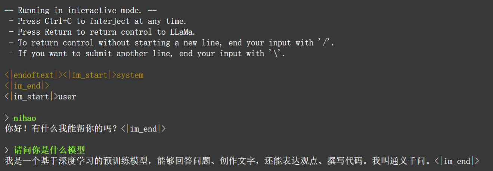
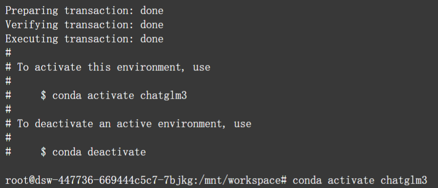

# 实验一

 软件2203-李凯-2022224193

## 一、课堂检查内容

### 1. Shell脚本

1. **实验内容**：写⼀个Shell脚本，要求创建⼀个⽬录osdir，在osdir中新建三个文件(f1,f2,f3)，f1记录当前系统的内存占⽤情 况，f2记录该文件的路径信息，f3记录三个文件的详细信息（ls -l）

1. **实验步骤以及截图**：

   1. 用vim命令创建Shell脚本文件
      

   1. 编写脚本内容
      

   1. 编译该Shell脚本
      

   1. 使用`ls`命令查看是否生成osdir文件夹，并进入osdir文件夹查看生成的f1,f2,f3文件

      

   1. 查看f1,f2,f3文件内容，测试脚本是否成功运行
      

1. **实验总结体会**

   * 在该实验中我学会了Linux系统中的一些典型命令如`ls`、`cd`、`cat` 的用法
   * 了解了如何使用vim编辑器，能够熟练运⽤，进⾏文本和程序代码编辑
   * 熟悉了一些shell脚本语言的语法如创建目录`mkdir`、新建文件`touch`、管道`|`、重定向`>`、显示系统内存使用情况`free`、列出当前目录下的文件和子目录`ls -l`、显示当前工作目录`pwd`。
   * 学会如何修改shell脚本文件可执行权限`chmod +x filename`

### 2. Linux系统编译c文件

1. **实验内容**：在osdir⽬录下写⼀个hello.c程序，⽤gcc编译并输出“hello world”

1. **实验步骤及其截图**

   1. vim创建.c文件，编写代码
      

      

   1. `gcc`编译该文件并运行可执行文件
      

1. **实验总结体会**

   * 在该实验中我学会了如何在Linux系统中编译c文件`gcc 文件名 -o 可执行文件名`

## 二、LLM实验：大模型部署

### 1. 模型部署

#### 1.1 模型下载

* **创建download_model.py文件下载代码**

  ```python
  from modelscope.hub.file_download import model_file_download 
  
  model_dir = model_file_download(model_id='qwen/Qwen1.5-0.5B-Chat-GGUF',file_path='qwen1_5-0_5b-chat-q5_k_m.gguf',revision='master',cache_dir='/mnt/workspace/LLM/dir') 
  ```
  
  
  
  
  
* **执行该Python文件**
  

  

#### 1.2 下载llama.cpp

* **使⽤git命令克隆llama.cpp项⽬**

  ```tex
  git clone https://github.com/ggerganov/llama.cpp 
  ```

  

* **编译llama.cpp项目**

  ```tex
  cd llama.cpp 
  make -j 
  ```

  

#### 1.3 加载模型，并执行

* **在llama.cpp⽬录中执⾏命令**
  
  ```bash
   ./main -m /mnt/workspace/LLM/dir/qwen/Qwen1.5-0.5B-Chat-GGUF/qwen1_5-0_5b-chat-q5_k_m.gguf -n 512 --color -i -cml
  ```
  
  
  
  

### 2. 基于OpenVINO的模型量化实践

[参考网站](https://github.com/OpenVINO-dev-contest/Qwen2.openvino/blob/main/README_zh.md#qwen2openvino-demo)

#### 2.1 安装基本环境

1. **克隆远程仓库到服务器**

   ```bash
   git clone https://github.com/OpenVINO-dev-contest/Qwen2.openvino.git
   ```

   

2. **环境配置**

   ```bash
   python3 -m venv openvino_env
   
   source openvino_env/bin/activate
   
   python3 -m pip install --upgrade pip
   
   pip install wheel setuptools
   
   pip install -r requirements.txt
   ```

#### 2.2**下载模型**

```bash
export HF_ENDPOINT=https://hf-mirror.com
huggingface-cli download --resume-download --local-dir-use-symlinks False Qwen/Qwen1.5-0.5B-Chat --local-dir  {your_path}/Qwen1.5-0.5B-Chat
```

####  2.3 转换模型

```bash
python3 convert.py --model_id Qwen/Qwen1.5-0.5B-Chat --precision int4 --output {your_path}/Qwen1.5-0.5B-Chat-ov
```


#### 2.4 加载模型并执行

```bash
python3 chat.py --model_path {your_path}/Qwen1.5-0.5B-Chat-ov --max_sequence_length 4096 --device CPU
```


#### 2.3. 运行示例


### 3. 其他LLM大模型（ChatGLM-6B）

[参考资料](https://zhuanlan.zhihu.com/p/671834423)

1. 创建一个新的 Anaconda 环境，命令 `conda create -n chatglm3 python=3.8`

   

   创建成功后用`conda activate chatglm3`激活新建的Anaconda环境

   

1. 进入 [ChatGLM3 GitHub 项目](https://link.zhihu.com/?target=https%3A//github.com/THUDM/ChatGLM3)，用`git`克隆项目到服务器。

   ```bash
   git clone https://github.com/THUDM/ChatGLM3
   ```

   

   进入克隆的项目文件

   ```bash
   cd ChatGLM3
   ```

   

3. 输入 `pip install -r requirements.txt` 安装项目环境

4. 下载 ChatGLM3-6b 模型

- ```
  git lfs install
  git clone https://www.modelscope.cn/ZhipuAI/chatglm3-6b.git
  ```

- 

5. 下载完后，会有一个 `chatglm3-6b`，进入找到pytorch_model.bin和tokenizer.model，记录这两个文件的路径。然后在basic_demo中找到cli_demo.py

   

   修改cli_demo.py中的路径为自己服务器中的pytorch_model.bin和tokenizer.model地址。

5. 运行示例

   

   

### 4. 大模型部署心得

在进行LLM（Large Language Model）大模型部署的过程中，我积累了一些宝贵的经验。通过部署三个不同模型的实验，我深刻领悟到了模型部署的复杂性和挑战性，同时也学到了很多解决问题的方法。

* 在模型下载和编译阶段，我学会了如何使用Python脚本和git命令来下载和管理模型文件，以及如何编译源代码以准备模型的加载。这个过程相对比较直接，但是在配置环境和解决依赖问题上也需要一定的耐心和技巧。

* 在加载模型并执行时，我遇到了一些路径配置和依赖库版本的问题。通过查阅文档和尝试不同的解决方案，我逐渐摸索出了解决方法，并成功地加载并运行了模型。这个过程中我学到了灵活运用命令行参数和环境变量的重要性，以及如何调试和排查错误。

* 最后，在部署ChatGLM-6B模型时，我遇到了一些路径配置和环境依赖的挑战。通过认真阅读文档和寻求帮助，我成功地克服了这些困难，并完成了模型的部署和运行。这个过程让我意识到了良好的文档的重要性，也提醒了我在学习和实践中保持耐心和恒心的重要性。


## 三、相关链接

### 1. GitHub链接

https://github.com/likaikkk/LLM-Deployment-Experimental-Code

### 2. CSDN链接

https://blog.csdn.net/lewis_kai/article/details/138550299?csdn_share_tail=%7B%22type%22%3A%22blog%22%2C%22rType%22%3A%22article%22%2C%22rId%22%3A%22138550299%22%2C%22source%22%3A%22lewis_kai%22%7D

